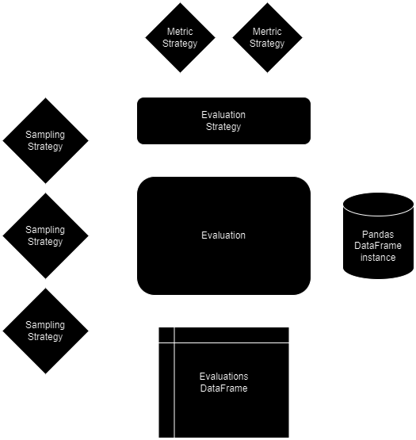

<h1 align="center"> Reto de programación de Coinscrap </h1>
<p align="center"> Problema del etiquetado mínimo: técnicas de muestreo y validación de datos. </p>


<h2>Planteamiento</h2>
El problema a resolver es encontrar técnicas de muestreo que permitan generar, a partir de un data lake, un dataset que se utilizará en entrenamiento supervisado.
La muestra, por lo tanto, debe ser todo lo representativa que se puede de la población, ya que esperamos un rendimiento óptimo en producción. Por el contrario,
la muestra debe ser lo más reducida posible, pues estaremos ahorrando en costos de etiquetado.

Para el reto, asumimos a priori que:
- La columna de categoría se utilizará para entrenar el modelo.
- Los dos archivos .csv se pueden usar en conjunto.
- La solución debe ser flexible y fácil de escalar y mantener.

Además, tras un análisis exploratorio inicial, asumimos que:
- Las anomalías en la distribución temporal de los datos se debe al proceso de generación utilizado para crearlos.
- La distribución de la columna ``amount`` se ve afectada por el tamaño reducido de los datos generados.

<h2>Solución</h2>
A la hora de analizar este problema, me planteé algunas cuestiones importantes acerca de la validación de los métodos de muestreo. ¿Cómo puedo saber si el muestreo 
que se ha realizado es realmente bueno? Pues, desde mi conocimiento como graduado en Psicología y apasionado por la investigación científica, puedo decir que esto no es tarea sencilla.
La única forma de realmente comprobar si un muestreo es bueno, es pasar por todo el proceso de etiquetado, entrenamiento y puesta en producción del modelo final. Ahí es cuando se puede medir el desempeño del modelo mediante técnicas como las pruebas A/B y extraer conclusiones. Es decir, necesitamos evidencia empírica, de lo contrario, nuestras decisiones solamente podrán ser informadas por nuestra experiencia en el sector. No obstante, aquí queremos ser _data driven_, así que he planteado una estrategia de acercarnos lo máximo posible a tomar decisiones en base a lo que sabemos que está pasando, y no en base a lo que creemos que va a pasar.

En primer lugar, he pensado que el mejor curso de acción es separar las responsabilidades. Lo que queremos es una criba con la que tomar una decision. Concretamente, una que muestre lo representativas que son las muestras generadas con un muestreo a lo largo de diferentes tamaños muestrales, ya que el objetivo es abaratar los costes de etiquetado sin perder representatividad. Surge un problema principal, ¿cómo medimos el desempeño de una técnica de muestreo? Esta pregunta va a estar vigente durante cada uno de los ciclos de vida del modelo, y la respuesta va a depender siempre de la investigación que se haga en el sector. Para nuestro propósito, vamos a crear un pequeño modelo que tome una población y una muestra como entrada, y devuelva una tabla con la evaluación de representatividad de cada una de las columnas de los datos. Como punto de partida, el modelo evaluativo es bastante simple y se centra exclusivamente en comparar las distribuciones de los datos entre la muestra y la población, para ver como de semejantes son la una a la otra.

Ahora, podemos pensar en diferentes estrategías de muestreo. Se me ocurre hacer un muestreo aleatorio simple y utilizarlo como control. Ahora, los dos muestreos que realmente creo que pueden puntuar bien en las métricas de nuestro método de evaluacion son el muestreo aleatorio estratificado, y el muestreo por clustering. El primero es simple y es el que todos conocen. La idea del segundo es aplicar un algoritmo de clustering a la población, y luego tomar la muestra con el cluster como estrato.

En este diagrama se puede ver el funcionamiento general del procedimiento.


Pueden ver y leer todo en más detalle en los notebooks eda y main.

<h2>Apéndice</h2>

Se ha utilizado Pandas para este _proof of concept_ porque estoy más familiarizado con esa biblioteca y soy capaz de hacer un desarrollo más veloz. Sin embargo, 
partiendo de este punto en adelante, lo ideal es refactorizar y continuar con el desarrollo utilizando un software como Spark. Esto permitiría una fácil integración 
del modelo en las pipelines y facilitaría el trabajo con grandes volúmenes de datos.

<h3>Dependencias</h3>

- Python 3.10.11

- Requirements:
    ```r
    altair==5.1.2
    asttokens==2.4.1
    attrs==23.1.0
    blinker==1.7.0
    branca==0.7.0
    cachetools==5.3.2
    certifi==2023.11.17
    charset-normalizer==3.3.2
    click==8.1.7
    colorama==0.4.6
    comm==0.2.0
    debugpy==1.8.0
    decorator==5.1.1
    exceptiongroup==1.1.3
    executing==2.0.1
    fastjsonschema==2.19.0
    folium==0.14.0
    gitdb==4.0.11
    GitPython==3.1.40
    idna==3.4
    importlib-metadata==6.8.0
    ipykernel==6.26.0
    ipython==8.17.2
    jedi==0.19.1
    Jinja2==3.1.2
    joblib==1.3.2
    jsonschema==4.20.0
    jsonschema-specifications==2023.11.1
    jupyter_client==8.6.0
    jupyter_core==5.5.0
    markdown-it-py==3.0.0
    MarkupSafe==2.1.3
    matplotlib-inline==0.1.6
    mdurl==0.1.2
    nbformat==5.9.2
    nest-asyncio==1.5.8
    numpy==1.26.2
    packaging==23.2
    pandas==2.1.3
    parso==0.8.3
    Pillow==10.1.0
    platformdirs==4.0.0
    plotly==5.18.0
    prompt-toolkit==3.0.41
    protobuf==4.25.1
    psutil==5.9.6
    pure-eval==0.2.2
    pyarrow==14.0.1
    pydeck==0.8.1b0
    Pygments==2.16.1
    python-dateutil==2.8.2
    pytz==2023.3.post1
    pywin32==306
    pyzmq==25.1.1
    referencing==0.31.0
    requests==2.31.0
    rich==13.7.0
    rpds-py==0.13.0
    scikit-learn==1.3.2
    scipy==1.11.4
    six==1.16.0
    smmap==5.0.1
    stack-data==0.6.3
    streamlit==1.28.2
    streamlit-folium==0.16.0
    tenacity==8.2.3
    threadpoolctl==3.2.0
    toml==0.10.2
    toolz==0.12.0
    tornado==6.3.3
    traitlets==5.13.0
    typing_extensions==4.8.0
    tzdata==2023.3
    tzlocal==5.2
    urllib3==2.1.0
    validators==0.22.0
    watchdog==3.0.0
    wcwidth==0.2.10
    zipp==3.17.0
    ```